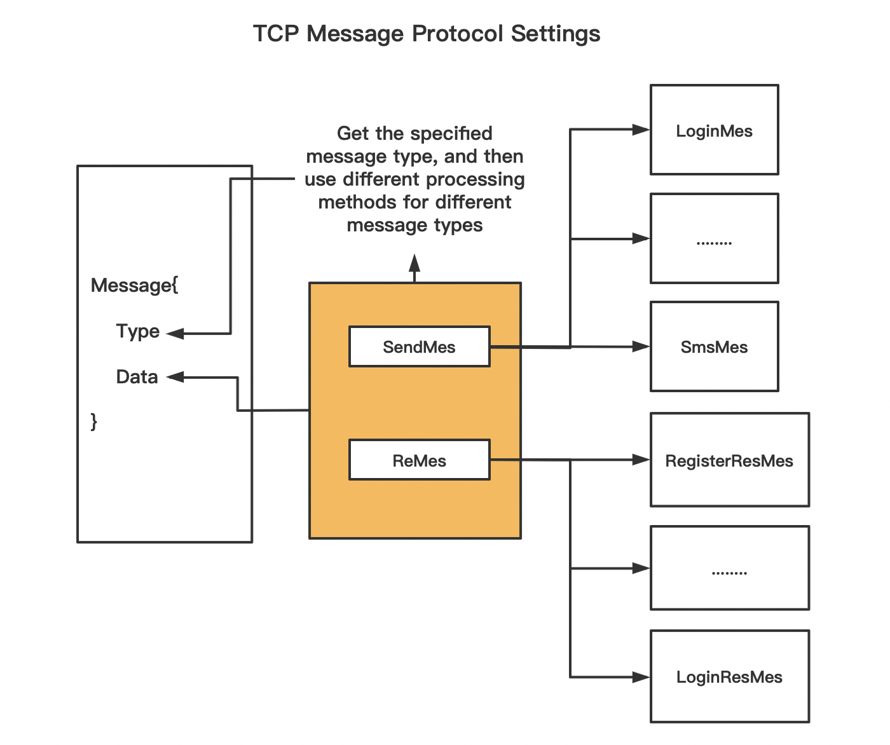
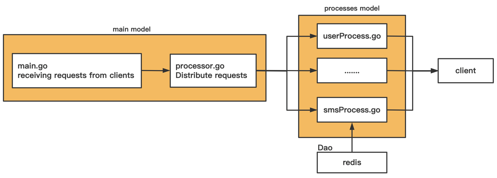
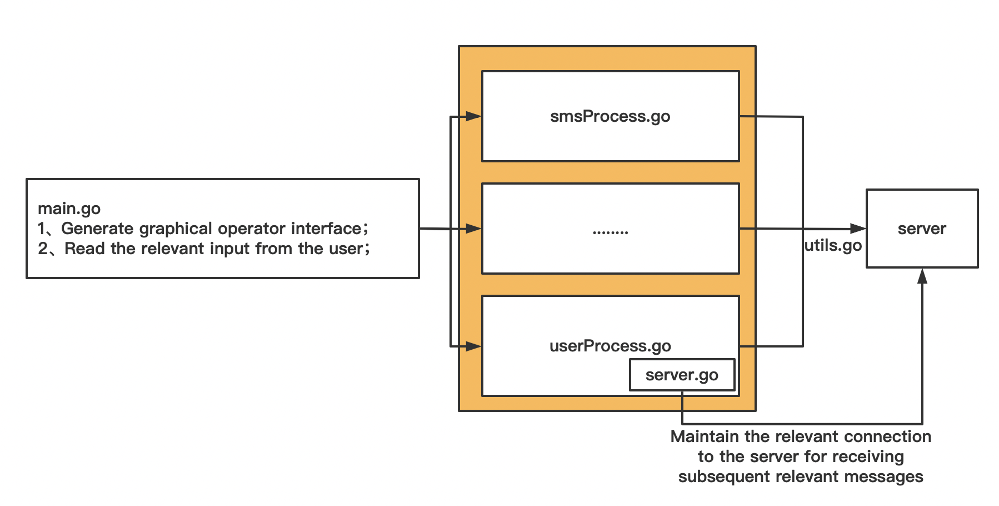

# ChatRoom
## 1.1 项目说明
本项目主要是在学习Go基础之后，为了加深对与Go基础语法的掌握而实现的一个多人在线聊天室。具体细节如下所示
## 1.2 技术栈的涉及
客户端、服务端：Go
数据库：redis
## 1.3 实现的主要功能
- 登陆
- 注册
- 在线多人聊天
## 1.4 关键部分的设计
#### 1.4.1 消息协议的设计
消息协议的设计是socket编程中比较关键的一部分，既要考虑到实现当前功能，又要考虑将来能够容易扩展。综合多种因素，本项目的消息设计逻辑如下所示

#### 1.4.2 服务端的设计
服务端主要是处理客户端发送过来的请求，为了合理的处理不同的请求以及满足后期扩展的需要，我们使用指定的处理模块来分发我们请求，本项目服务端设计具体如下所示

#### 1.4.3 客户端的设计
客户端在获得到用户的指定输入后，会将信息进行解析处理成能够传输的形式。同时在发送消息的时候，为了防止丢包，在这里我们会先将数据的长度传输给服务器，然后传输消息本身，再在服务器上检查消息本身的长度和接受到服务器端传入过来的长度是否相同，如果不同，再通知客户端重发消息

